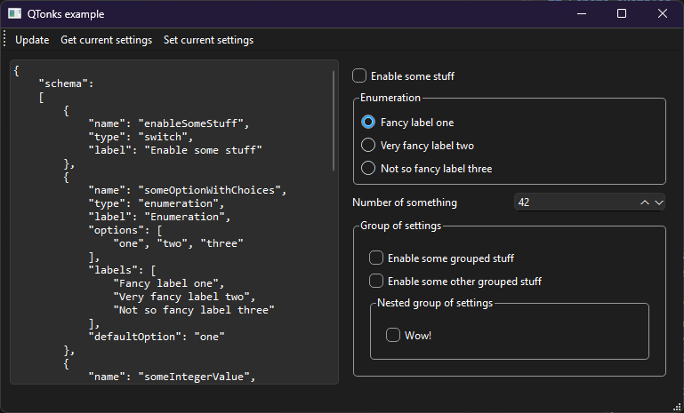

# QTonks

*Don't call me Nymphadora*

A library built on top of Qt Widgets that allows you to dynamically build UIs for displaying and 
editing settings based on a JSON schema.

1. Define your settings schema (see schema example below)
2. QTonks will build a UI based on it
3. Changing each setting from a UI will emit a signal with JSON containing all the settings
4. You can load a JSON with current settings to update a UI as well

## Supported widgets

- `Switch`: a checkbox with a label that can be on or off
- `Enumeration`: a group of options you can choose from
- `Integer`: a field with an integer number and up/down buttons
- `Group`: a container for any number of nested QTonks widgets

## How it looks



## Schema examples

```json
{
    "schema":
    [
        {
            "name": "enableSomeStuff",
            "type": "switch",
            "label": "Enable some stuff"
        },
        {
            "name": "someOptionWithChoices",
            "type": "enumeration",
            "label": "Enumeration",
            "options": [
                "one", "two", "three"
            ],
            "labels": [
                "Fancy label one",
                "Very fancy label two",
                "Not so fancy label three"
            ],
            "defaultOption": "one"
        },
        {
            "name": "someIntegerValue",
            "label": "Number of something",
            "type": "integer",
            "min": 0,
            "max": 100,
            "default": 42
        },
        {
            "name": "someGroup",
            "type": "group",
            "label": "Group of settings",
            "content": 
            [
                {
                    "name": "enableSomeGroupedStuff",
                    "type": "switch",
                    "label": "Enable some grouped stuff"
                },
                {
                    "name": "enableSomeOtherGroupedStuff",
                    "type": "switch",
                    "label": "Enable some other grouped stuff"
                },
                {
                    "name": "nestedGroup",
                    "type": "group",
                    "label": "Nested group of settings",
                    "content": 
                    [
                        {
                            "name": "nestedSwitch",
                            "type": "switch",
                            "label": "Wow!"
                        }
                    ]
                }
            ]
        }
    ]
}
```
